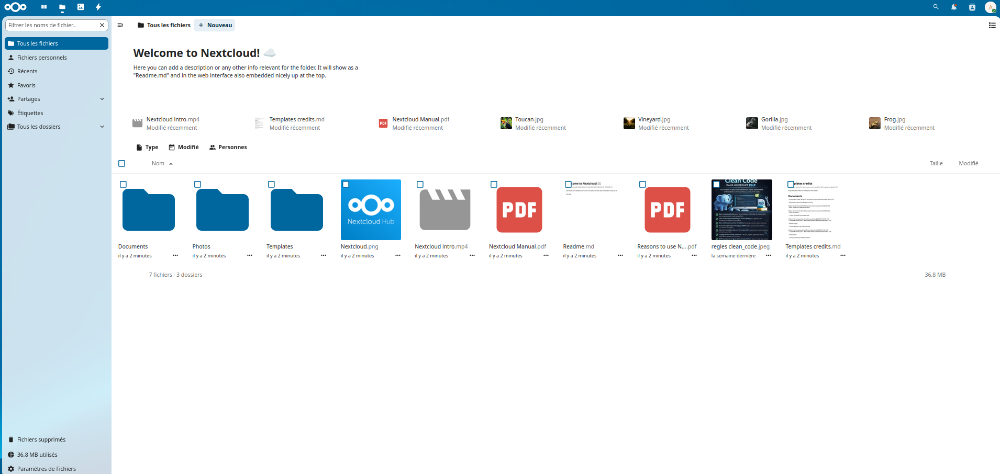
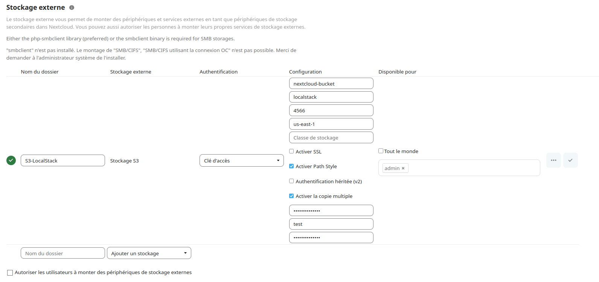
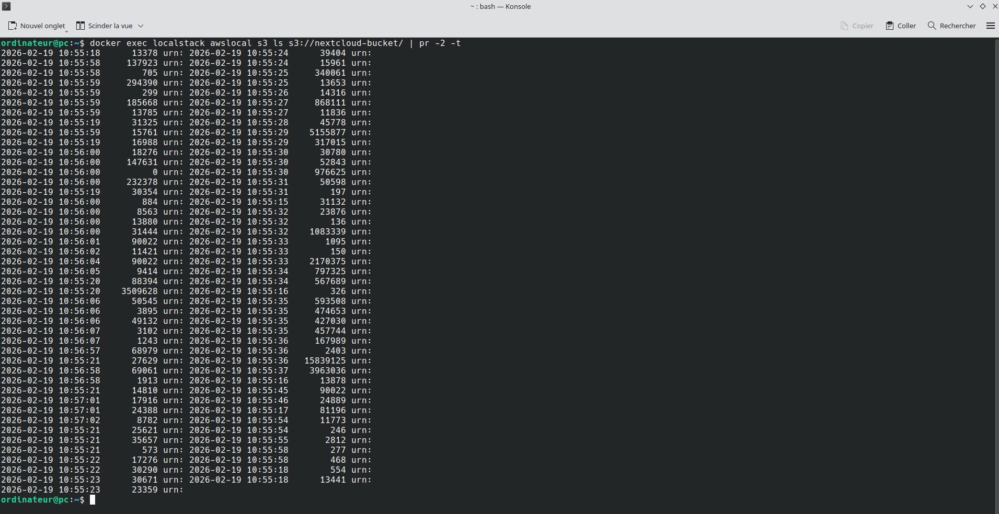

# nextcloud-aws-s3-docker

Ce projet démontre le déploiement de Nextcloud avec un stockage externe S3 simulé par LocalStack, le tout orchestré avec Docker Compose.

## Déploiement

### Prérequis

- Docker installé
- Docker Compose installé

### Étapes

#### 1️⃣ Cloner ou créer le projet

```bash
mkdir nextcloud-localstack-project
cd nextcloud-localstack-project
```
#### 2️⃣ Cloner le repository

```bash
git clone https://github.com/boris-valero/nextcloud-aws-s3-docker.git
```
#### 3️⃣ Lancer les services

```bash
cd nextcloud-aws-s3-docker
docker-compose up -d
```
#### 4️⃣ Initialiser le script

```bash
cd scripts
./init_s3.sh
```
#### 5️⃣ Configurer Nextcloud

1.  Accéder à http://localhost:8082
2.  Créer un compte administrateur avec, par exemple :
  - Utilisateur : `admin` (ou celui de votre choix)
  - Mot de passe : `admin` (ou celui de votre choix)
3.  Aller dans le menu de Nextcloud > Applications  
4.  Allez dans les applications désactivées, et activer l'application "External storage support"
5.  Aller dans le menu de Nextcloud > Paramètres d'administration > Stockages externes
6.  Ajouter un stockage Amazon S3 avec :
  - Hostname : `localstack`
  - Port : `4566`
  - Bucket : `nextcloud-bucket`
  - Region : `us-east-1`
  - Access Key / Secret Key : `nextcloud-aws-s3` / `nextcloud-aws-s3`
  - **Enable SSL** : décoché
  - **Enable Path Style** : coché

#### 6️⃣ Tester

1.  Uploader un fichier dans le dossier S3 de Nextcloud
2.  Vérifier dans un terminal que le fichier se soit bien chargé :

```bash
docker exec -it localstack awslocal s3 ls s3://nextcloud-bucket/ --recursive
```
## Captures d'écran

### Interface Nextcloud avec dossier S3



### Configuration du stockage externe



### Vérification dans LocalStack



